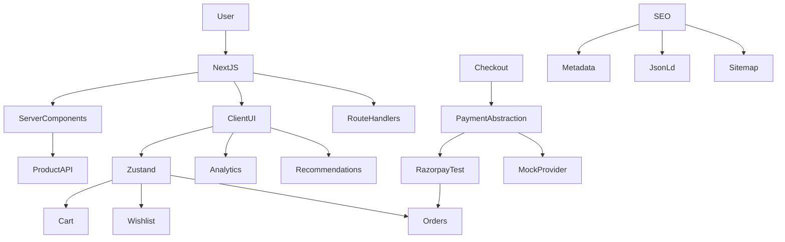

# Lumina Skin — Performance-First Ecommerce Storefront

A performance-focused skincare ecommerce storefront built with Next.js, TypeScript, and modern frontend practices. Built as a portfolio project inspired by the **problem domain** of performance commerce — **not** a copy of any proprietary brand UI, content, or code.

> **Status:** Phase 8 complete — Razorpay Test Mode, webhooks, performance polish, and final QA.

## Tech Stack

- Next.js (App Router)
- React
- TypeScript
- Tailwind CSS
- TanStack Query
- Zustand (cart, wishlist, orders)
- React Hook Form + Zod
- Razorpay Test Mode (Orders API + Checkout + webhooks)
- Jest / React Testing Library / Playwright

## Features

- Product discovery, search, filters, sorting, pagination
- Product details (gallery, variants, reviews, related)
- Wishlist & cart with localStorage persistence
- Checkout with **Cash on Delivery** + **Razorpay Test Mode** online payment
- Server-side payment order creation and signature verification
- Razorpay webhook HMAC verification with duplicate-event protection
- Order history & tracking UI
- Account dashboard
- Skin-concern personalization (rule-based)
- Mock GA4/GTM analytics layer
- SEO: metadata, OpenGraph, JSON-LD, sitemap, robots
- Automated unit, component, and E2E tests

## Running Locally

```bash
npm install
npm run dev
```

```bash
npm run build
npm start
```

```bash
npm run lint
npm run typecheck
npm run test
npm run test:coverage
npm run test:e2e
```

## Environment Variables

Create `.env.local`:

```env
NEXT_PUBLIC_SITE_URL=http://localhost:3000
NEXT_PUBLIC_API_URL=http://localhost:3000/api

# "mock" for local/CI without Razorpay keys; "razorpay" for Test Mode demo
PAYMENT_MODE=mock

# Server-only — never expose to the browser
RAZORPAY_KEY_ID=
RAZORPAY_KEY_SECRET=
RAZORPAY_WEBHOOK_SECRET=

# Public key for Checkout.js only
NEXT_PUBLIC_RAZORPAY_KEY_ID=
```

| Variable | Client? | Purpose |
| --- | --- | --- |
| `RAZORPAY_KEY_SECRET` | No | Order creation + payment signature verification |
| `RAZORPAY_WEBHOOK_SECRET` | No | Webhook HMAC validation |
| `RAZORPAY_KEY_ID` / `NEXT_PUBLIC_RAZORPAY_KEY_ID` | Public ID only | Razorpay Checkout |
| `PAYMENT_MODE` | No | `mock` (default) or `razorpay` |

Never commit `.env.local`. `.env.example` contains placeholders only.

## Payment Gateway Integration

This project integrates **Razorpay Test Mode** to demonstrate a real payment gateway workflow.

### Flow

```text
Checkout
↓
Server creates Razorpay Order (trusted cart pricing)
↓
Razorpay Checkout (or local mock checkout when keys are absent)
↓
Payment
↓
Client receives payment identifiers
↓
Server verifies payment signature
↓
Application Order Created
↓
Cart Cleared

Razorpay Webhook
↓
Webhook Signature Verification
↓
Payment Status Update
```

### Architecture

```mermaid
flowchart TD

    User[Customer]

    User --> Checkout[Checkout UI]

    Checkout --> CreateOrder[POST /api/payments/create-order]

    CreateOrder --> Server[Next.js Server]

    Server --> RazorpayAPI[Razorpay API]

    RazorpayAPI --> RazorOrder[Razorpay Order]

    RazorOrder --> Browser[Browser]

    Browser --> RazorCheckout[Razorpay Checkout]

    RazorCheckout --> Payment[Payment]

    Payment --> Callback[Payment Callback]

    Callback --> Verify[POST /api/payments/verify]

    Verify --> Signature[Server Signature Verification]

    Signature --> Order[Application Order]

    Order --> Cart[Clear Cart]

    RazorpayAPI --> Webhook[Razorpay Webhook]

    Webhook --> WebhookAPI[/api/webhooks/razorpay]

    WebhookAPI --> HMAC[Webhook Signature Verification]

    HMAC --> Status[Update Payment Status]

    Checkout --> Analytics[Analytics]

    Server --> Data[Application Data]
```

The Razorpay secret key is never exposed to the client.

Payment signatures are verified server-side.

Webhook signatures are verified before processing events.

Payment data is not stored in localStorage.

### Payment Security

- Razorpay secret keys are server-side only
- Webhook secret is server-side only
- Client payment amounts are not trusted blindly (catalog reprice + claimed-total check)
- Payment signatures are verified server-side
- Webhook signatures are validated
- Duplicate webhook processing is prevented
- No card numbers or CVV are stored
- No UPI credentials are stored
- Test Mode is used for demonstration

### Razorpay Test Mode

This project uses Razorpay Test Mode for demonstration purposes.

No real money is processed.

Configure the required Razorpay test credentials in `.env.local`.

Do not commit credentials.

Use Razorpay’s current official test cards / UPI methods from their documentation when `PAYMENT_MODE=razorpay`.

When keys are missing, `PAYMENT_MODE=mock` opens a local mock checkout (used by automated tests).

### Local Webhook Testing

Razorpay cannot reach `localhost` directly. Expose the app with an HTTPS tunnel and register:

```text
https://<your-public-domain>/api/webhooks/razorpay
```

Set the same webhook secret in the Razorpay dashboard and in `RAZORPAY_WEBHOOK_SECRET`.

### Payment Integration — Interview Summary

The checkout uses Razorpay Test Mode.

The client requests a payment order from a Next.js server endpoint. The server creates the Razorpay order using the secret key and returns the order ID.

The browser then opens Razorpay Checkout using the public key ID.

After payment, the client sends the payment identifiers to the server. The server verifies the Razorpay signature before creating the application's order.

The application also exposes a Razorpay webhook endpoint. Webhook signatures are verified before payment events are processed, and duplicate events are handled safely.

No sensitive card or payment credentials are stored by the application.

Cash on Delivery remains available as an offline path and does not use Razorpay.

## Architecture



**Server Components** render product catalog and SEO. **Client Components** handle cart/wishlist, checkout forms, Razorpay checkout, skin-concern interaction, and analytics.

## Personalization

Homepage section: **What’s your skin concern?**

Concerns: Acne, Dryness, Pigmentation, Sun Protection, Sensitive Skin, Dullness.

Selecting a concern filters and ranks catalog products tagged with that concern.

## Recommendation Engine

The system is **rule-based** — not machine learning or AI.

Scores (when concern matches): Concern match +5, Rating ≥ 4.5 +2, Best seller +1, Popularity +0–2.

Implementation: `src/lib/recommendations/product-recommendations.ts`

## Analytics

```text
UI / stores → trackEvent() → MockAnalyticsProvider → console (dev only)
```

Checkout-related events: `begin_checkout`, `payment_initiated`, `payment_success`, `payment_failed`, `purchase`.

Purchase fires only after successful verification (or COD confirmation). No card/CVV/UPI secrets are tracked.

## SEO

- Homepage & products: indexable titles/descriptions + OpenGraph
- Product PDP: `generateMetadata` + canonical + OG image + Product / Breadcrumb JSON-LD
- Search: dynamic title; **`noindex`**
- Cart / checkout / wishlist / account / orders: **`noindex, nofollow`**
- `/sitemap.xml` and `/robots.txt` for public routes

## Accessibility

Semantic landmarks (`main`, `banner`, `navigation`), labeled forms, aria on quantity/wishlist/payment controls, focus states, live regions for toasts and cart counts, accessible mock Razorpay dialog.

## Performance

Optimizations:

- Server Components by default; client islands for interactivity
- `next/image` with `priority` only on true LCP images (hero + PDP main)
- `next/font` (Outfit + Fraunces)
- TanStack Query: `staleTime` 60s, `gcTime` 5m, no refetch-on-focus
- Zustand selectors (header uses `getItemCount()`)
- Hydration-safe persist via `useSyncExternalStore`
- Route-level loading UI for products/search/PDP

### Performance Before vs After

| Metric | Before | After |
| --- | --- | --- |
| Lighthouse Performance | Not measured | Not measured |
| LCP | Not measured | Not measured |
| CLS | Not measured | Not measured |
| INP | Not measured | Not measured |
| Initial JS | Not measured | Not measured |
| Transfer Size | Not measured | Not measured |

Measure locally with:

```bash
npm run build
npm start
```

Then Chrome Lighthouse / PageSpeed Insights on `/` and a product page.

## Testing

### Unit Testing

Jest covers cart, wishlist, recommendations, checkout validation, trusted cart pricing, payment order creation, signature verification, webhook HMAC + idempotency.

### Component Testing

React Testing Library covers ProductCard, SearchBar, CartItem, CheckoutForm (COD + Razorpay order start), WishlistButton, SkinConcernSelector, and related UI.

### End-to-End Testing

Playwright covers discovery, search, cart, wishlist, COD checkout, mock Razorpay success/failure, and recommendations.

```bash
npm run test
npm run test:coverage
npm run test:e2e
```

### Testing Architecture

```text
                 ┌─────────────────────┐
                 │   Application UI    │
                 └──────────┬──────────┘
                            │
              ┌─────────────┴─────────────┐
              │                           │
       Component Tests              E2E Tests
     React Testing Library          Playwright
              │                           │
              └─────────────┬─────────────┘
                            │
                      Business Logic
                            │
                           Jest
```

## Folder Structure

```text
src/
├── app/api/payments/     # create-order, verify, mock-sign
├── app/api/webhooks/     # razorpay webhook
├── components/checkout/  # CheckoutForm, RazorpayCheckout, …
├── lib/payment/          # providers, trusted cart, sessions, webhooks
├── store/                # cart, wishlist, orders
├── __tests__/
e2e/
```

## Known Limitations

- Razorpay is configured in Test Mode (or local mock mode without keys)
- No real money is processed
- Backend/database is mocked where applicable (in-memory payment sessions + Zustand orders)
- Authentication is not implemented
- Analytics is mocked
- Recommendation engine is rule-based
- This is **not** a PCI-compliant production payment system
